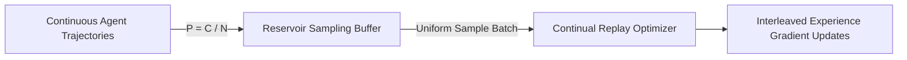

# GenPark Experience Replay Reservoir Sampling Skill

Continual learning streaming experience replay buffer with Vitter's reservoir sampling.

Discover more agent tools at [GenPark](https://genpark.ai) and the [GenPark MCP Catalog](https://genpark.ai/mcp).

## Features
- Bounded $O(C)$ capacity memory footprint.
- Uniform probability guarantee across arbitrarily long streams.
- Zero external dependencies.
